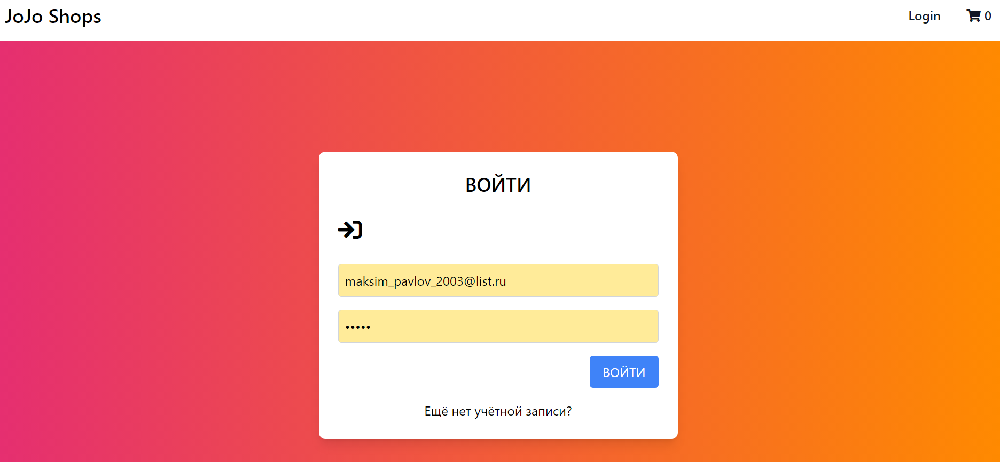

# Интернет магазин электронной техники "JoJo Shops"
**Выполнил студент группы 22307:** Максим Павлович Павлов  
**Направление подготовки:** 09.03.04. - Программная инженерия  
**Место прохождения практики:** Кафедра Информатики и математического обеспечения  
**Сроки прохождения практики:** 05.02.24 - 26.05.24  
**Руководитель практики:** ст. преподаватель В. М. Димитров 

[Отчёт о прохождении практики](./docs/Павлов%20М.%20П.%20Отчёт%20о%20прохождении%20учебной%20практики.pdf)

Проект интеренет магазина на Fastapi и react с применением sqlalchemy, redux, and Postgresql. 
Реализован в рамках дисциплины "Человеко-машинные интерфейсы".

## API магазина

url: http://localhost:8000/docs

## Инструкция по использования

<ul>
    <li>
        Установиить Python
    </li>
    <li>
        Установиить postgresql
    </li>
    <li>
        Установиить Pipenv pip install pipenv
    </li>
    <li>
        Установиить Npm and Nodejs
    </li>
    <li>
        перейти в папку backend и выполнить команду pipenv install
    </li>
    <li>
       перейти в папку  frontend и выполнить команду npm install
    </li>
    <li>
        запустить backend, выполнив команду uvicorn main:app --reload в директории backend/app 
    </li>
    <li>
        запустить frontend, выполнив команду npm start
    </li>
</ul>

## Краткий отчёт о прототипе магазина

Страница авторизации

Страница регистрации

Домашняя страница

Просмотр информации о товаре

Корзина

Оплата товара (используется сторонний сервис оплаты - Stripe).

Страница заказов пользователя.

Информация о Заказе.

Панель администратора. Список пользователей.

Панель администратора и менеджера. Список товаров.

Панель администратора и менеджера. Добавление товара.

Панель администратора и менеджера. Изменение информации о товаре.

Панель администратора и менеджера. Список заказов.

